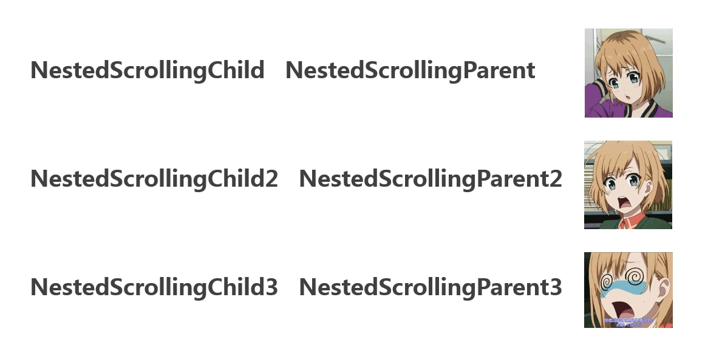
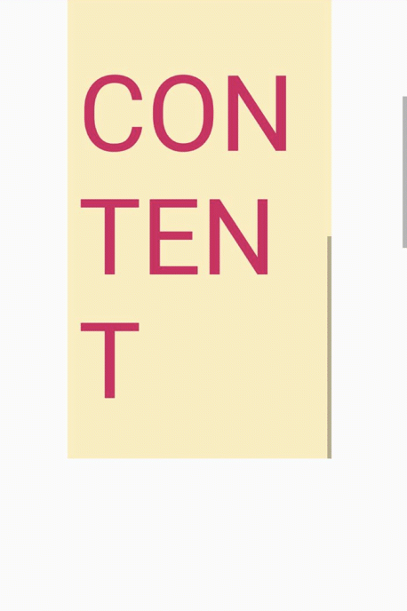

# NestedScrollingHistory



---

What's NestedScrolling?

What's different between `NestedScrollingChild` / `NestedScrollingChild2` / `NestedScrollingChild3` ?

Why newest(`androidx.core 1.1.0-alpha01`) `NestedScrollView` sometimes out of control?


---

You can see all details [here]() ([中文]()).

You also can get better `NestedScrollView4` instead of `NestedScrollView` bellow.

---

`NestedScrollView4` use like



[](https://github.com/RubiTree/NestedScrollingHistory/releases/tag/1.0.1)
[](https://github.com/RubiTree/NestedScrollingHistory/blob/master/LICENSE)

For Gradle

Step 1. Add the JitPack repository in your root build.gradle at the end of repositories:

```groovy
allprojects {
    repositories {
        ...
        maven { url 'https://jitpack.io' }
    }
}
```

Step 2. Add the dependency

```groovy
dependencies {
        implementation 'com.github.RubiTree:NestedScrollingHistory:1.0.1'
}
```

## License
Apache License 2.0, here is the [LICENSE](https://github.com/RubiTree/NestedScrollingHistory/blob/master/LICENSE).